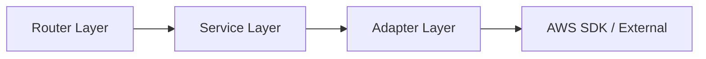

# Technical Rules & Guidelines

This document defines the technical standards, coding conventions, and architectural rules for the AWS Bedrock RAG API project.

---

## 🏗️ Architectural Rules

### 1. Layer Separation (MANDATORY)

**Rule:** Components must only communicate with adjacent layers.



**Enforcement:**

- Routers must **not** instantiate adapters directly.
- Services must **not** import `boto3` clients.
- Adapters are the **only** layer allowed to use AWS SDKs.

**Rationale:** ensures that business logic (Service) is decoupled from infrastructure details (AWS). This allows swapping infrastructure (e.g., S3 to Azure Blob) without changing the Service layer.

---

### 2. DTO Organization (MANDATORY)

**Rule:** DTOs must be organized by **architectural layer**.

```text
✅ CORRECT STRUCTURE:
app/dtos/
├── common.py          # Shared enums/types
├── routers/           # API Request/Response models
│   ├── chat.py
│   └── ingest.py
└── adapters/          # External service DTOs (if needed)
    ├── s3.py
    └── bedrock.py
```

**Rationale:**

- Layer-based organization reflects data flow.
- Prevents circular dependencies.
- Makes data contracts explicit at layer boundaries.

---

### 3. Response Format & Status Codes (MANDATORY)

**Rule:**

1. **Services** must return **Pydantic Models** (Domain Objects), NEVER raw dictionaries.
2. **Routers** return the Pydantic model directly.
3. Use **HTTP Status Codes** to indicate success or failure. Do NOT use a generic `{ "success": true }` wrapper.

**Service Layer:**

```python
# ✅ CORRECT: Service returns Pydantic Model
def get_document(self, doc_id: str) -> DocumentDTO:
    data = self.s3_adapter.get_object(doc_id)
    return DocumentDTO(id=doc_id, content=data.content)
```

**Router Layer:**

```python
# ✅ CORRECT: HTTP 200/201 + Direct Model
@router.post("/docs", status_code=201)
async def create_doc(request: CreateDocRequest) -> DocumentDTO:
    return service.create_document(request)

# ❌ BAD: Wrapper pattern (Deprecated)
return {"success": True, "data": result}
```

---

### 4. Exception Handling Strategy (MANDATORY)

**Rule:** Exception handling is divided into **Translation** (Adapter) and **Presentation** (Middleware).

1.  **Adapters (Translation Layer):** MUST catch technical exceptions (e.g., `boto3`, `requests`) and **raise Domain Exceptions**.
    - _Goal:_ Isolate the Service layer from low-level library details.
2.  **Services & Routers:** MUST NOT use `try-catch` blocks for flow control. Let Domain Exceptions propagate.
3.  **Middleware (Presentation Layer):** Catches Domain Exceptions and converts them to standard HTTP Error Responses.

**Implementation Example:**

```python
# 1. Adapter Layer: Translates Technical Error -> Domain Error
class S3Adapter:
    def get_file(self, key: str):
        try:
            self.client.get_object(Bucket=..., Key=key)
        except ClientError as e:
            error_code = e.response['Error']['Code']
            if error_code == 'NoSuchKey':
                # ✅ Translate to Domain Exception
                raise DocumentNotFoundError(f"File {key} not found")
            if error_code == 'AccessDenied':
                raise StoragePermissionError("Access denied")
            # Re-raise unexpected errors
            raise e

# 2. Service Layer: Pure Business Logic (No try-catch)
class IngestionService:
    def process_file(self, key: str):
        # Implicitly allows DocumentNotFoundError to bubble up
        file = self.s3_adapter.get_file(key)
        return file

# 3. Middleware: Domain Error -> HTTP Response
@app.exception_handler(DocumentNotFoundError)
async def not_found_handler(request, exc):
    return JSONResponse(
        status_code=404,
        content={"error": "not_found", "message": str(exc)}
    )
```

---

### 5. Dependency Injection (MANDATORY)

**Rule:** Services must use **Constructor Injection**. Do not instantiate dependencies (Adapters) inside the Service.

**Service Definition:**

```python
# ✅ CORRECT: Constructor Injection
class RAGService:
    def __init__(self, s3_adapter: S3Adapter, bedrock_adapter: BedrockAdapter):
        self.s3_adapter = s3_adapter
        self.bedrock_adapter = bedrock_adapter

# ❌ BAD: Internal Instantiation
class RAGService:
    def __init__(self):
        self.s3_adapter = S3Adapter()  # VIOLATION: Hard dependency
```

**Router Wiring (FastAPI Depends):**

```python
# app/dependencies.py
def get_s3_adapter() -> S3Adapter:
    return S3Adapter()

def get_rag_service(
    s3: Annotated[S3Adapter, Depends(get_s3_adapter)]
) -> RAGService:
    return RAGService(s3_adapter=s3)

# Router
@router.post("/chat")
async def chat(
    service: Annotated[RAGService, Depends(get_rag_service)]
):
    ...
```

---

## 📝 Coding Standards

### 6. Type Hints (MANDATORY)

**Rule:** All functions must have complete type annotations for arguments and return values.

```python
def upload_document(
    self,
    file_content: bytes,
    metadata: Optional[Dict[str, Any]] = None
) -> UploadResultDTO:
    ...
```

---

### 7. Pydantic Models (MANDATORY)

**Rule:** All DTOs must be Pydantic `BaseModel` subclasses with validation.

```python
class ChatRequest(BaseModel):
    query: str = Field(..., min_length=1, description="User query")
    max_results: int = Field(default=5, ge=1, le=100)

    class Config:
        json_schema_extra = {
            "example": {"query": "Explain quantum computing"}
        }
```

---

### 8. Logging (MANDATORY)

**Rule:** Use structured logging with appropriate levels (`logger.info`, `logger.error`).

- **NEVER** use `print()`.
- **NEVER** log sensitive data (API Keys, PII).

---

### 9. Test Organization (MANDATORY)

**Rule:** Use a **Mirrored Directory Structure** for tests. This ensures tests are easily excluded from production builds.

```text
✅ CORRECT STRUCTURE:
project_root/
├── app/
│   └── services/
│       └── rag_service.py
└── tests/
    └── services/
        └── test_rag_service.py    # Mirrors app structure
```

**Naming:**

- Test files: `test_<module_name>.py`
- Test classes: `class Test<ClassName>:`

---

### 10. Mock Usage & Testing Strategy (MANDATORY)

**Rule:**

1. **Service Tests:** Use **Constructor Injection** to pass Mock objects. Do NOT use `patch` unless absolutely necessary.
2. **Adapter Tests:** Use `patch` to mock external libraries (`boto3`, `requests`).

**Service Layer Test (Preferred):**

```python
class TestRAGService:
    def test_query_flow(self):
        # 1. Create Mocks with defined specs (ensures interface match)
        mock_s3 = Mock(spec=S3Adapter)
        mock_bedrock = Mock(spec=BedrockAdapter)

        # 2. Setup Behavior
        mock_bedrock.generate.return_value = "AI Answer"

        # 3. Inject Mocks via Constructor
        service = RAGService(s3_adapter=mock_s3, bedrock_adapter=mock_bedrock)

        # 4. Act & Assert
        result = service.query("question")
        assert result == "AI Answer"
        mock_bedrock.generate.assert_called_once()
```

**Adapter Layer Test:**

```python
class TestS3Adapter:
    @patch('boto3.client')
```
